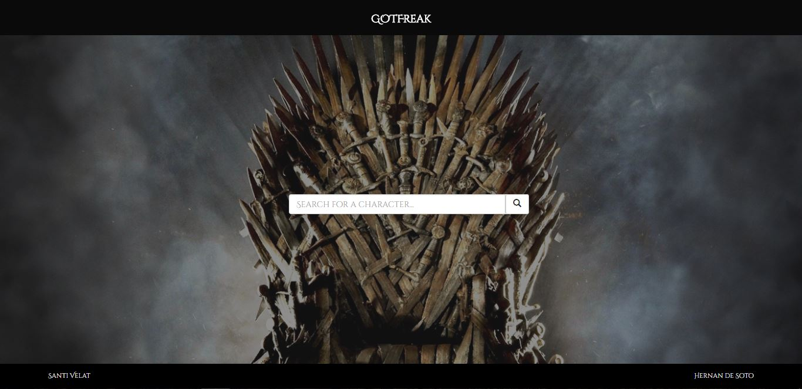
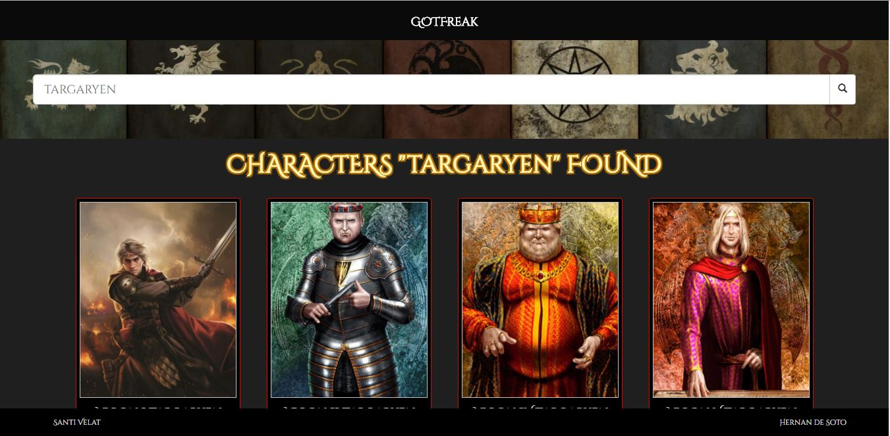
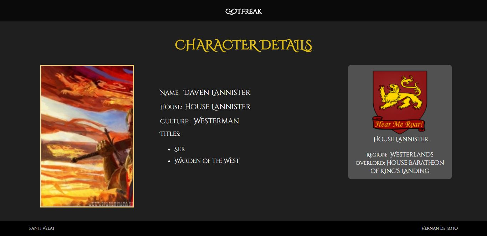

# [GOTFreak](https://github.com/SantiVelat/GOTFreak)

        
 

---

### Description

GOTFreak is a site to search for information related to all the characters from the Games of Thrones world. The user can search for a name and obtain all the characters with that name.
For each character selected it will show some extra information like his House, the coat of arms and the culture it belongs.
This is possible thanks to the API made available at: (https://api.got.show/doc/).

We made this excercise at the 4th Week of the Skylab Coders Academy at the end of July 2017.

---

### Screenshots 

##### Home screenshot: 

##### Search results screenshot:

##### Character details:

---

### Dependencies

We use the following dependencies to make this webpage possible:

- `AngularJS 1.6.4`

- `AngularJS route 1.6.3`

- `Bootstrap`

- `jQuery (as a dependency for Bootstrap)`

---

## API
This application uses the API endpoints made public thanks to the work of 

 jhis application relies on  external API services for geolocalitzation and events information:

* [API ENDPOINTS AND DOCUMENTATION](https://api.got.show/doc/)
* [WEB PAGE](https://got.show/)

---

## Authors

- [Santi Velat](https://github.com/SantiVelat)
- [Hernán de Soto](https://github.com/hdesoto)